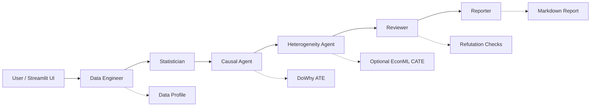

# Multi-Agent Causal Analytics Team MVP

这是一个适合统计学学生简历展示的本地因果分析项目。项目把一次结构化数据分析拆成多个职责明确的 Agent：先做数据画像和方法判断，再用 DoWhy 估计 ATE，使用 refutation 做稳健性检查，并在 EconML 可用时补充 CATE 异质性分析，最后生成 Markdown 报告。

当前版本聚焦第一阶段 MVP：稳定、本地、可测试、可演示。不依赖 LangGraph、OpenAI API、数据库、登录系统或部署平台。DeepSeek / LLM 报告增强是可选能力，默认关闭，不影响主流程验收。

## MVP 功能

- 上传 `.csv`、`.xlsx`、`.xls`、`.xlsm` 文件，或直接使用内置营销样例数据
- 选择 Treatment、Outcome、Confounders、Effect Modifiers
- Data Engineer Agent 生成数据画像
- Statistician Agent 给出因果分析方法建议和风险提示
- Causal Agent 使用 DoWhy 估计 ATE
- DoWhy 不可用时自动使用降级线性调整估计，并在结果中给出 warning
- Reviewer Agent 检查三类 refutation：`placebo_treatment`、`random_common_cause`、`data_subset`
- Heterogeneity Agent 可选使用 EconML 估计 CATE
- EconML 不可用时 CATE 返回 `skipped`，主流程继续运行
- Reporter Agent 生成 `Multi-Agent Causal Analytics Team Report`
- Streamlit 前端展示 ATE、CATE 状态、refutation、Reviewer 检查、Agent 日志，并支持 Markdown 下载
- pytest 覆盖端到端 pipeline、Excel/CSV 数据读取、CATE optional skip 和 refutation 结构

## 可选功能：LLM-assisted Variable Recommendation

当前版本提供一个默认关闭的 LLM 变量推荐入口。用户可以输入自然语言问题，例如“优惠券是否提升购买率？”，系统会基于当前数据集列名和简单字段画像，尝试推荐：

- Treatment
- Outcome
- Confounders
- Effect Modifiers

该功能只作为 UI 辅助，不会自动运行因果分析，也不会替代手动变量选择。没有 DeepSeek API key 时会显示 `skipped`；LLM 返回格式错误时会 fallback，用户仍然可以手动选择所有变量。

该功能复用现有可选 DeepSeek 配置，但不属于 deterministic MVP 的必要依赖。不要把真实 API key 写入代码、README 或提交到 GitHub。

## Agent 架构

当前流程由 `AnalyticsTeamOrchestrator` 按固定顺序编排：

1. `CoordinatorAgent`：生成执行计划
2. `DataEngineerAgent`：生成数据画像
3. `StatisticianAgent`：判断方法和风险
4. `CausalAgent`：估计 ATE
5. `HeterogeneityAgent`：可选估计 CATE
6. `ReviewerAgent`：检查输入、ATE、CATE 和 refutation
7. `ReporterAgent`：生成本地 Markdown 报告
8. `DeepSeekReporterAgent`：可选报告增强，默认关闭，不属于 MVP 验收条件



## 目录结构

```text
app/
  ui_streamlit.py              # Streamlit 前端入口
  agents/
    team.py                    # 核心 Agent
    llm_reporter.py            # 可选 DeepSeek 报告增强
  core/
    orchestrator.py            # 工作流编排器
    report.py                  # Markdown 报告生成
    schemas.py                 # 请求和结果结构
  services/
    data_loader.py             # CSV / Excel 读取
    profile_service.py         # 数据画像
    method_service.py          # 方法选择
    causal_dowhy.py            # DoWhy ATE 与 fallback
    cate_econml.py             # 可选 EconML CATE
    deepseek_client.py         # 可选 DeepSeek 客户端
data/
  generate_synthetic.py        # 样例数据生成脚本
  sample_marketing.csv         # 内置样例数据
tests/
  test_orchestrator.py
  test_data_loader.py
  test_cate_optional_skip.py
  test_refutations.py
requirements.txt
requirements-causal.txt
requirements-cate.txt
pytest.ini
```

## 安装步骤

建议使用 Python 3.11 或 3.12 的虚拟环境。

```powershell
cd causal-agent
python -m venv .venv
.\.venv\Scripts\python.exe -m pip install -U pip
.\.venv\Scripts\python.exe -m pip install -r requirements.txt
```

启用 DoWhy：

```powershell
.\.venv\Scripts\python.exe -m pip install -r requirements-causal.txt
```

可选启用 EconML：

```powershell
.\.venv\Scripts\python.exe -m pip install -r requirements-cate.txt
```

EconML 依赖较重，安装失败不影响 ATE、Reviewer 和本地报告生成。

## 运行命令

生成样例数据：

```powershell
.\.venv\Scripts\python.exe data\generate_synthetic.py
```

运行测试：

```powershell
.\.venv\Scripts\python.exe -m pytest -q
```

启动前端：

```powershell
.\.venv\Scripts\streamlit.exe run app\ui_streamlit.py
```

浏览器打开：

```text
http://localhost:8501
```

## 项目截图占位

建议在上传 GitHub 前补充一张 Streamlit 首页或分析结果页截图，并在 README 顶部附近引用：

```markdown

```

截图建议包含：项目介绍区、Treatment / Outcome 配置、ATE metric、CATE 状态、refutation 表格和 Markdown 报告下载按钮。

## 样例数据说明

内置样例数据是一个营销优惠券场景：

- Treatment：`coupon`
- Outcome：`purchase`
- Confounders：`age`、`income`、`prior_spend`、`visits`
- Effect Modifier：`visits`

样例数据故意设置了访问次数更高的用户对优惠券反应更强，因此安装 EconML 后，CATE 分组摘要通常能看到高访问组的处理效应更高。

## 可选依赖说明

`requirements.txt` 只放基础运行依赖，包括 Streamlit、pandas、pytest 和 Excel 读取需要的 openpyxl。

`requirements-causal.txt` 用于安装 DoWhy。安装后，Causal Agent 会使用 DoWhy 的 `backdoor.linear_regression` 做 ATE 估计，并运行三类 refutation。

`requirements-cate.txt` 用于安装 EconML。安装后，Heterogeneity Agent 会使用 `LinearDML` 做 CATE 分析；未安装时会返回 `skipped`。

DeepSeek / LLM 报告增强不在基础依赖中，也不是运行 MVP 的必要条件。未配置 `.env` 或未勾选前端选项时，系统只使用本地 Reporter Agent 生成 Markdown 报告。

LLM-assisted Variable Recommendation 也使用同一套可选 DeepSeek 配置。未配置 `.env` 时变量推荐会安全跳过，不影响手动选择变量、ATE、CATE、Reviewer 或 Markdown 报告。

## 当前限制

- 第一阶段不使用 LangGraph
- 第一阶段不接入 OpenAI API
- 第一阶段不做自动因果发现
- 第一阶段不做用户登录、数据库或部署
- 当前 DAG 由用户选择的变量构造，因果假设需要分析者自己负责
- DeepSeek 报告增强是可选能力，默认关闭，不作为 MVP 验收条件
- LLM 变量推荐只是辅助选择字段，不等同于自动因果发现，也不会证明因果识别成立

## 后续路线图

- 增加更细的变量校验和数据清洗建议
- 增加更多估计方法选择，例如倾向得分、匹配、双重稳健估计
- 增加图表和 PDF 报告导出
- 将固定顺序编排升级为 LangGraph 工作流
- 接入 LLM 做变量推荐、报告润色和人机协作解释
- 增加更多真实公开数据集案例

## 90 秒 Demo Script

更完整的版本见 [docs/demo_script.md](docs/demo_script.md)。

1. 0-15 秒：介绍项目目标：一个用于因果分析的多 Agent 数据分析团队。
2. 15-30 秒：打开 Streamlit，使用内置营销样例数据。
3. 30-45 秒：展示变量配置：Treatment=`coupon`、Outcome=`purchase`、Confounders 和 Effect Modifiers。
4. 45-65 秒：运行分析，展示 ATE metric、CATE 状态和 refutation 表格。
5. 65-80 秒：展示 Reviewer warnings、Agent 日志和 Markdown 报告。
6. 80-90 秒：强调工程亮点：可选依赖 graceful skip、pytest 端到端测试、GitHub 可复现。

## 面试问题与回答要点

更完整的版本见 [docs/interview_notes.md](docs/interview_notes.md)。

- 为什么用 Multi-Agent？  
  为了把数据画像、方法判断、因果估计、稳健性检查和报告生成拆成清晰职责，便于测试和展示。
- 为什么 DoWhy 是核心？  
  DoWhy 的流程天然对应建模、识别、估计和 refutation，适合展示因果推断方法论。
- EconML 为什么是 optional？  
  EconML 依赖较重，CATE 属于增强能力；缺失时主流程仍应完成 ATE、Reviewer 和报告。
- 这个项目的因果结论可靠吗？  
  结果依赖用户指定的混杂变量和因果假设，Reviewer 只能做稳健性提示，不能自动证明因果识别成立。

## 简历描述示例

Multi-Agent Causal Analytics Team MVP：设计并实现一个基于 Streamlit 的多 Agent 因果分析工具，支持 CSV/Excel 上传、数据画像、因果变量配置、DoWhy ATE 估计、三类 refutation 稳健性检查、可选 EconML CATE 异质性分析和 Markdown 报告生成；通过 pytest 覆盖端到端 pipeline、可选依赖降级路径和数据读取流程，展示统计建模、因果推断和 Python 工程化能力。

## 简历 Bullet Point

- Built a Streamlit-based Multi-Agent Causal Analytics Team that supports CSV/Excel upload, data profiling, DoWhy ATE estimation, refutation checks, optional EconML CATE analysis, and Markdown report generation.
- Designed a modular agent workflow covering Data Engineer, Statistician, Causal Agent, Heterogeneity Agent, Reviewer, and Reporter roles, with pytest coverage for end-to-end execution and optional dependency fallback paths.

## GitHub 上传提醒

不要上传以下内容：

- `.env`
- `.venv/`
- `__pycache__/`
- `*.pyc`
- `.pytest_cache/`
- `pytest_tmp/`
- `test_artifacts/`
- `.streamlit/secrets.toml`
- `.DS_Store`
