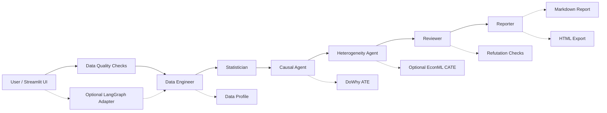

# Multi-Agent 因果分析团队 MVP

这个项目的思路是把一次完整的结构化数据分析拆给几个职责清晰的 Agent 来做：先画数据画像、判断分析方法，再用 DoWhy 估计平均处理效应（ATE），跑 refutation 做稳健性检验，如果装了 EconML 的话还会顺带做 CATE 异质性分析，最后生成 Markdown 报告。

现阶段的重点是稳定、纯本地、能测试、能 demo，适合直接推到 GitHub 展示。不依赖 OpenAI API，也不需要数据库或登录系统。DeepSeek / LLM 报告增强是个可选功能，默认关掉，不影响主流程。v0.4 加了轻量的数据质量检查和 Streamlit 内置图表；v0.5 加了一个默认关闭的 LangGraph 实验编排适配层，主要是用来展示多 Agent 工作流的工程能力。

---

## 能做什么

- 上传 `.csv`、`.xlsx`、`.xls`、`.xlsm`，或者直接用内置的营销样例数据跑起来
- 手动选 Treatment、Outcome、Confounders、Effect Modifiers
- 在跑因果分析之前，先看一眼 Data Quality Summary：缺失率、重复行、常量列、高基数分类列、treatment 分组平衡、outcome 质量、以及完整样本量
- Data Engineer Agent 出数据画像
- Statistician Agent 给方法建议和风险提示
- Causal Agent 用 DoWhy 估 ATE；没装 DoWhy 的话会降级用线性调整估计，结果里会带 warning 提示
- Reviewer Agent 跑三类 refutation：`placebo_treatment`、`random_common_cause`、`data_subset`
- Heterogeneity Agent 可选用 EconML 估 CATE；没装的话返回 `skipped`，主流程照常继续
- Reporter Agent 生成报告
- Streamlit 前端展示所有结果，支持下载 Markdown / HTML 报告
- 可选 LangGraph 编排模式，没装 `langgraph` 的话自动回退到确定性编排
- pytest 覆盖端到端 pipeline、Excel/CSV 读取、数据质量、CATE 可选跳过、refutation 结构和报告导出

---

## 可选功能：LLM 辅助变量推荐

这个功能默认关闭。开启后，用户可以用自然语言描述问题，比如"优惠券是否提升了购买率？"，系统会根据当前数据集的列名和字段画像，尝试推荐 Treatment、Outcome、Confounders 和 Effect Modifiers。

有几点要说清楚：它只是 UI 辅助，不会自动触发因果分析，也不替代你手动选变量。没配 DeepSeek API key 的话会显示 `skipped`；LLM 返回格式有问题时会 fallback，你还是可以手动选所有变量。

这个功能复用现有的可选 DeepSeek 配置，但不是 MVP 主流程的必要依赖。**别把真实 API key 写进代码、README 或提交到 GitHub。**

---

## 可选功能：LangGraph 实验编排

v0.5 加了一个默认关闭的 LangGraph 编排模式。它只是换了一种 Agent 调度方式，ATE、CATE、refutation、数据质量检查、变量推荐、报告导出这些核心逻辑一概没动。

用法很简单：

- 默认不勾选，走现有的确定性 `AnalyticsTeamOrchestrator`
- 勾选"Use experimental LangGraph orchestration"且装了 `langgraph`，走 `app/graph/langgraph_runner.py`
- 勾选了但没装 `langgraph`，Streamlit 会弹 warning，自动回退到确定性编排

这个模式不用 OpenAI API，也不做 checkpoint、持久化、人工干预、动态路由或 LLM 规划器。

---

## Agent 架构

现在的流程由 `AnalyticsTeamOrchestrator` 按固定顺序跑：

1. `CoordinatorAgent`：生成执行计划
2. `DataEngineerAgent`：数据画像
3. `StatisticianAgent`：方法判断和风险提示
4. `CausalAgent`：估计 ATE
5. `HeterogeneityAgent`：可选估计 CATE
6. `ReviewerAgent`：检查输入、ATE、CATE 和 refutation
7. `ReporterAgent`：生成本地 Markdown 报告
8. `DeepSeekReporterAgent`：可选报告增强，默认关闭，不算 MVP 验收条件



---

## 目录结构

```text
app/
  ui_streamlit.py              # Streamlit 前端入口
  agents/
    team.py                    # 核心 Agent
    llm_reporter.py            # 可选 DeepSeek 报告增强
  graph/
    langgraph_runner.py        # 可选 LangGraph 实验编排层
  core/
    orchestrator.py            # 工作流编排器
    report.py                  # Markdown 报告生成
    report_export.py           # HTML 报告导出
    schemas.py                 # 请求和结果结构
  services/
    data_loader.py             # CSV / Excel 读取
    data_quality.py            # 数据质量检查
    profile_service.py         # 数据画像
    method_service.py          # 方法选择
    causal_dowhy.py            # DoWhy ATE 与 fallback
    cate_econml.py             # 可选 EconML CATE
    deepseek_client.py         # 可选 DeepSeek 客户端
data/
  generate_synthetic.py        # 样例数据生成脚本
  sample_marketing.csv         # 内置样例数据
tests/
  test_orchestrator.py
  test_data_loader.py
  test_cate_optional_skip.py
  test_refutations.py
  test_report_export.py
  test_data_quality.py
  test_langgraph_runner.py
requirements.txt
requirements-causal.txt
requirements-cate.txt
requirements-langgraph.txt
pytest.ini
```

---

## 安装

建议用 Python 3.11 或 3.12 的虚拟环境。

```powershell
cd causal-agent
python -m venv .venv
.\.venv\Scripts\python.exe -m pip install -U pip
.\.venv\Scripts\python.exe -m pip install -r requirements.txt
```

装 DoWhy：

```powershell
.\.venv\Scripts\python.exe -m pip install -r requirements-causal.txt
```

可选装 EconML：

```powershell
.\.venv\Scripts\python.exe -m pip install -r requirements-cate.txt
```

EconML 依赖比较重，装失败了也不影响 ATE、Reviewer 和本地报告。

可选装 LangGraph：

```powershell
.\.venv\Scripts\python.exe -m pip install -r requirements-langgraph.txt
```

没装的话，前端勾选实验编排模式也会自动回退，不会报错。

---

## 怎么跑

生成样例数据：

```powershell
.\.venv\Scripts\python.exe data\generate_synthetic.py
```

跑测试：

```powershell
.\.venv\Scripts\python.exe -m pytest -q
```

启动前端：

```powershell
.\.venv\Scripts\streamlit.exe run app\ui_streamlit.py
```

浏览器打开：

```
http://localhost:8501
```

---

## 截图占位

推到 GitHub 之前，建议截一张 Streamlit 的界面图，放在 README 顶部附近引用：

```markdown

```

截图最好包含：项目介绍区、变量配置、Data Quality Summary、ATE 指标、CATE 状态、refutation 表格，以及 Markdown / HTML 下载按钮。

---

## 样例数据说明

内置的是一个营销优惠券场景：

- Treatment：`coupon`
- Outcome：`purchase`
- Confounders：`age`、`income`、`prior_spend`、`visits`
- Effect Modifier：`visits`

数据是故意设计成"高访问量用户对优惠券反应更强"的，所以装了 EconML 之后，CATE 分组摘要里通常能看到高访问组的处理效应明显更高。

---

## 数据质量检查

v0.4 在跑因果分析之前加了一个独立的数据质量检查环节，不会改动 ATE、CATE 或 refutation 的计算逻辑。检查结果以普通 dict 返回，展示在 Streamlit、Markdown 报告和 HTML 报告中。

目前做的检查包括：

- 基础信息：行数、列数、字段类型分布
- 缺失情况：每列的 missing count 和 missing rate、整体缺失率、高缺失字段 warning
- 重复行、常量列、高基数分类字段
- 数值字段分布摘要和 IQR 异常值计数
- Treatment 存在性、分组计数、是否有变化、是否严重不平衡
- Outcome 存在性、是否有变化、缺失率
- 已选变量的缺失情况、complete-case 样本量和 confounder 缺失 warning

这些结果只用于分析前诊断，不参与因果效应的估计。

---

## 依赖说明

`requirements.txt` 只放基础依赖：Streamlit、pandas、pytest、openpyxl。

`requirements-causal.txt` 装 DoWhy。装上之后 Causal Agent 会用 `backdoor.linear_regression` 估 ATE，并跑三类 refutation。

`requirements-cate.txt` 装 EconML。装上之后 Heterogeneity Agent 用 `LinearDML` 做 CATE；没装的话返回 `skipped`。

`requirements-langgraph.txt` 装 LangGraph。装上之后可以在 Streamlit 里勾选实验编排模式；没装的话会 warning 并回退。

DeepSeek / LLM 增强不在基础依赖里，也不是跑 MVP 的必要条件。没配 `.env` 或没勾选前端选项的话，系统只用本地 Reporter Agent 出 Markdown 报告。

LLM 变量推荐也用同一套可选 DeepSeek 配置。没配的话会安全跳过，不影响手动选变量、ATE、CATE、Reviewer 或 Markdown 报告。

---

## 报告导出

现在支持两种下载格式：

- **Markdown**：轻量文本，方便复制到 README、笔记或 Issue，下载时会附上 Data Quality Summary。
- **HTML**：基于同一个 `PipelineBundle` 生成展示型报告，包含变量配置、数据画像、Data Quality Summary、方法选择、ATE、CATE 状态、refutation、Reviewer warnings、Agent 日志和局限性说明。

HTML 导出纯用 Python 标准库，不需要新装依赖。PDF 暂时没做，以后可以作为可选功能加进来。

---

## 当前限制

- LangGraph 只是 v0.5 的实验适配层，默认关闭
- 目前不接 OpenAI API
- 没有自动因果发现
- 没有用户登录、数据库或部署
- DAG 由用户选择的变量构造，因果假设需要分析者自己负责
- 数据质量检查只是诊断和展示，不会自动清洗数据或修正因果设定
- DeepSeek 报告增强是可选功能，默认关闭，不算 MVP 验收条件
- LLM 变量推荐只是辅助选字段，不等于自动因果发现，也不能证明因果识别成立
- LangGraph 模式不做 checkpoint、持久化、人工干预、动态路由或 LLM planner

---

## 后续计划

- 加更细的数据清洗建议和异常处理策略
- 支持更多估计方法，比如倾向得分、匹配、双重稳健估计
- 加更多图表，考虑可选 PDF 导出
- 增强 LangGraph 工作流的可观测性和 demo 说明
- 接 LLM 做变量推荐、报告润色和人机协作解释
- 补充更多真实公开数据集案例

---

## 90 秒 Demo 脚本

完整版见 [docs/demo_script.md](docs/demo_script.md)。

1. **0–15 秒**：介绍项目目标：一个用于因果分析的多 Agent 数据分析团队。
2. **15–30 秒**：打开 Streamlit，用内置营销样例数据。
3. **30–45 秒**：展示变量配置和 Data Quality Summary：Treatment=`coupon`、Outcome=`purchase`、缺失率、重复行和 complete-case 样本量。
4. **45–65 秒**：运行分析，展示 ATE 指标、CATE 状态和 refutation 表格。
5. **65–80 秒**：展示 Reviewer warnings、Agent 日志，以及带 Data Quality Summary 的 Markdown / HTML 报告下载。
6. **80–90 秒**：强调工程亮点：可选依赖 graceful skip、pytest 端到端测试、GitHub 可复现。

---

## 面试问答要点

完整版见 [docs/interview_notes.md](docs/interview_notes.md)。

**为什么用 Multi-Agent？**
为了把数据画像、方法判断、因果估计、稳健性检查和报告生成拆成清晰的职责边界，好测试、好展示。

**为什么 DoWhy 是核心？**
DoWhy 的流程天然对应建模、识别、估计和 refutation 四个阶段，展示因果推断方法论很合适。

**EconML 为什么可选？**
依赖比较重，CATE 算异质性分析，属于增强能力；没装的话主流程照样能跑完 ATE、Reviewer 和报告。

**Data Quality Checks 会影响估计结果吗？**
不会。它只是分析前的诊断展示，帮你发现缺失、重复、不平衡和 complete-case 风险，不参与因果估计。

**这个项目的因果结论可靠吗？**
结论依赖你指定的混杂变量和因果假设，Reviewer 只能做稳健性提示，不能自动证明因果识别成立。

---

## 简历描述示例

Multi-Agent Causal Analytics Team MVP：设计并实现一个基于 Streamlit 的多 Agent 因果分析工具，支持 CSV/Excel 上传、数据质量检查、数据画像、因果变量配置、DoWhy ATE 估计、三类 refutation 稳健性检查、可选 EconML CATE 异质性分析和 Markdown / HTML 报告导出；通过 pytest 覆盖端到端 pipeline、可选依赖降级路径、数据读取和报告导出流程，展示统计建模、因果推断和 Python 工程化能力。

## 简历 Bullet Points

- Built a Streamlit-based Multi-Agent Causal Analytics Team that supports CSV/Excel upload, data quality checks, data profiling, DoWhy ATE estimation, refutation checks, optional EconML CATE analysis, and Markdown/HTML report export.
- Designed a modular agent workflow covering Data Engineer, Statistician, Causal Agent, Heterogeneity Agent, Reviewer, and Reporter roles, with pytest coverage for end-to-end execution and optional dependency fallback paths.

---

## 上传 GitHub 前记得排除

```
.env
.venv/
__pycache__/
*.pyc
.pytest_cache/
pytest_tmp/
test_artifacts/
.streamlit/secrets.toml
.DS_Store
```
