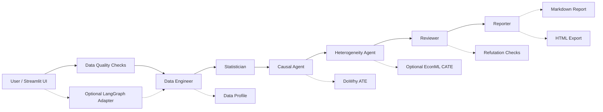

# Multi-Agent 因果分析团队 MVP
这个项目的思路是把一次完整的结构化数据分析拆给几个职责清晰的 Agent 来分工完成：先做数据画像、判断分析方法，再用 DoWhy 估计平均处理效应（ATE），跑 refutation 做稳健性检验，装了 EconML 的话还会顺带做 CATE 异质性分析，最后生成 Markdown / HTML / 可选 PDF 报告。

Latest version: v0.9 Streamlit App Testing and UX Reliability.

整个项目的重点是稳定、纯本地、能测试、能 demo，适合直接放到 GitHub 上展示。不依赖 OpenAI API，也不需要数据库或登录系统。DeepSeek / LLM 报告增强是可选功能，默认关闭，不影响主流程。版本演进上，v0.4 加入轻量数据质量检查和 Streamlit 内置图表；v0.5 加入默认关闭的 LangGraph 实验编排适配层；v0.6 打磨 HTML 报告并新增可选 PDF 导出；v0.7 正式强化 Advanced LangGraph Orchestration，并保留 deployment readiness / public demo safety 作为过渡增强；v0.8 增加 Causal Trust Summary、Robustness / Sensitivity Notes 和 Heterogeneity Explanation；v0.9 则补强 Streamlit AppTest smoke/regression tests 与 UX reliability，提升公开 demo 和后续迭代的稳定性.

## 功能

- 上传 `.csv`、`.xlsx`、`.xls`、`.xlsm` 文件，或直接使用内置营销样例数据
- 选择 Treatment、Outcome、Confounders、Effect Modifiers
- 在运行因果分析前展示 Data Quality Summary，包括缺失率、重复行、常量列、高基数分类列、treatment 分组平衡、outcome 质量、已选变量的完整样本量
- Data Engineer Agent 生成数据画像
- Statistician Agent 给出因果分析方法建议和风险提示
- Causal Agent 用 DoWhy 估 ATE；没装 DoWhy 的话降级用线性调整估计，结果里会带 warning 提示
- Reviewer Agent 检查三类 refutation：`placebo_treatment`、`random_common_cause`、`data_subset`
- Heterogeneity Agent 可选用 EconML 估 CATE；没装的话返回 skipped，主流程照常继续
- Causal Trust Summary、Sensitivity Notes 和 Heterogeneity Explanation 把因果结果转成更保守、更可解释的业务提示
- Reporter Agent 生成完整报告
- Streamlit 前端展示 Data Quality、ATE、CATE 状态、refutation、Reviewer 检查、Agent 日志，并支持 Markdown / HTML 下载和可选 PDF 下载
- 可选 LangGraph 编排模式，没装 langgraph 的话自动回退到确定性编排
- Advanced LangGraph mode：展示 experimental graph execution trace、step timeline 和 graph state summary
- 过渡性部署准备：public demo 安全提示、demo mode indicator、optional dependency status panel
- Streamlit AppTest smoke tests、demo-mode regression checks、关键 UI section 检查和 optional dependency fallback verification
- pytest 覆盖端到端 pipeline、Excel/CSV 读取、数据质量、CATE 可选跳过、refutation 结构、报告导出和 Streamlit app smoke tests


## 可选功能：LLM 辅助变量推荐

这个功能默认关闭。开启后，用户可以用自然语言描述问题，比如"优惠券是否提升了购买率？"，系统会根据当前数据集的列名和字段画像，尝试推荐 Treatment、Outcome、Confounders 和 Effect Modifiers。

注意：它只是 UI 辅助，不会自动触发因果分析，也不替代你手动选变量。没配 DeepSeek API key 的话会显示 `skipped`；LLM 返回格式有问题时会 fallback，你还是可以手动选所有变量。

这个功能复用现有的可选 DeepSeek 配置，但不是 MVP 主流程的必要依赖。


## v0.7 Advanced LangGraph Orchestration

v0.7 强化了默认关闭的 LangGraph 编排模式。它仍然只是换了一种 Agent 调度方式，ATE、CATE、refutation、数据质量检查、变量推荐、报告导出这些核心逻辑一概没动。

用法：
- 默认不勾选，走现有的确定性 `AnalyticsTeamOrchestrator`
- 勾选"Use experimental LangGraph orchestration"且装了 `langgraph`，走 `app/graph/langgraph_runner.py`
- 勾选了但没装 `langgraph`，Streamlit 会弹 warning，自动回退到确定性编排

Advanced LangGraph mode 会展示：

- orchestration mode
- graph execution trace / step timeline
- graph state summary
- demo-only human review checkpoint 说明

这个模式不用 OpenAI API，也不做 checkpoint、持久化、数据库、生产级人工干预、动态路由或 LLM 规划器。详细说明见 [docs/langgraph_v0.7.md](docs/langgraph_v0.7.md)。


## v0.8 Causal Robustness and Interpretability

v0.8 不是继续堆新的 Agent 框架功能，而是把重点放到因果分析结果的可信度、稳健性解释和业务可解释性上：把 ATE、refutation、数据质量 warning 和可选 CATE 输出，转换成更适合业务用户阅读的保守解释。

新增展示和报告能力：

- Causal Trust Summary：总结效应方向、稳健性等级、关键 warning 和建议。
- Robustness / Sensitivity Notes：基于已有 refutation 结果，保守判断 placebo、random common cause、data subset 下的方向稳定性。
- Heterogeneity Explanation：在 CATE 可用时解释 effect modifiers 和分层效应；CATE skipped/error 时 graceful skip。
- Markdown / HTML / optional PDF 报告在 pipeline 完成后附加这些解释摘要。

这些摘要不是自动因果发现，也不能证明因果识别成立。它们会明确提示 observational data limitations、unmeasured confounding risk 和 sample quality risk。v0.8 不修改 `orchestrator.py`、`schemas.py`、`causal_dowhy.py`、`cate_econml.py`、`variable_recommender.py` 或 `langgraph_runner.py`，deterministic pipeline 仍然是默认稳定路径。

Latest v0.8 verification: `78 passed, 1 skipped` with `python -m pytest -q`.


## v0.9 Streamlit App Testing and UX Reliability

v0.9 不新增复杂因果分析功能，而是补强 Streamlit app 层面的可测试性和 demo 稳定性。重点是让公开展示流程、optional dependency fallback、关键结果区和报告下载路径都能被回归测试覆盖。

新增内容：

- Streamlit AppTest smoke tests，验证 `app/ui_streamlit.py` 初始页面可以渲染且没有 uncaught exception。
- Demo mode regression checks，验证 public demo safety message 能正常展示。
- UI reliability checks，覆盖 Data Quality、Causal Trust Summary、Robustness / Sensitivity Notes、Heterogeneity Explanation、LangGraph 文案和 Markdown / HTML report downloads。
- Optional dependency status panel regression check，确保缺少 optional dependency 时 UI 不崩溃。
- README、CHANGELOG、AGENTS、demo script、interview notes 和 v0.9 release note 同步更新。

v0.9 仍然不接 OpenAI API，不新增数据库、登录或生产部署系统，不保存上传数据，也不把 LangGraph、EconML、ReportLab 或 DeepSeek 变成 mandatory dependency。核心 deterministic causal pipeline 保持不变。

Latest v0.9 verification: `82 passed, 1 skipped` with `python -m pytest -q`.

Interview talking point for v0.9:

> v0.9 不新增复杂因果功能，而是补充 Streamlit app-level tests 和 demo regression checks，用来证明 public demo safety message、optional dependency status、Data Quality、Causal Trust、Sensitivity、Heterogeneity、LangGraph 和 report download 等关键展示路径不会在后续迭代中被破坏。


## Agent 架构

现在的流程由 `AnalyticsTeamOrchestrator` 按固定顺序跑：

1. `CoordinatorAgent`：生成执行计划
2. `DataEngineerAgent`：数据画像
3. `StatisticianAgent`：方法判断和风险提示
4. `CausalAgent`：估计 ATE
5. `HeterogeneityAgent`：可选估计 CATE
6. `ReviewerAgent`：检查输入、ATE、CATE 和 refutation
7. `ReporterAgent`：生成本地 Markdown 报告
8. `DeepSeekReporterAgent`：可选报告增强，默认关闭，不算 MVP 验收条件




## 目录结构

```text
app/
  ui_streamlit.py              # Streamlit 前端入口
  agents/
    team.py                    # 核心 Agent
    llm_reporter.py            # 可选 DeepSeek 报告增强
  graph/
    langgraph_runner.py        # 可选 LangGraph 实验编排层
  core/
    orchestrator.py            # 工作流编排器
    pdf_export.py              # 可选 PDF 报告导出
    report.py                  # Markdown 报告生成
    report_export.py           # HTML 报告导出
    schemas.py                 # 请求和结果结构
  services/
    data_loader.py             # CSV / Excel 读取
    data_quality.py            # 数据质量检查
    dependency_status.py       # 可选依赖和 demo 配置状态
    causal_trust.py            # v0.8 因果可信度摘要
    sensitivity_service.py     # v0.8 稳健性 / sensitivity 摘要
    heterogeneity_explainer.py # v0.8 CATE 异质性解释摘要
    profile_service.py         # 数据画像
    method_service.py          # 方法选择
    causal_dowhy.py            # DoWhy ATE 与 fallback
    cate_econml.py             # 可选 EconML CATE
    deepseek_client.py         # 可选 DeepSeek 客户端
data/
  generate_synthetic.py        # 样例数据生成脚本
  sample_marketing.csv         # 内置样例数据
tests/
  test_orchestrator.py
  test_data_loader.py
  test_cate_optional_skip.py
  test_refutations.py
  test_report_export.py
  test_data_quality.py
  test_dependency_status.py
  test_causal_trust.py
  test_sensitivity_service.py
  test_heterogeneity_explainer.py
  test_langgraph_runner.py
  test_langgraph_trace.py
  test_streamlit_app_smoke.py
docs/
  deployment.md
  langgraph_v0.7.md
  releases/
    v0.9.md
requirements.txt
requirements-causal.txt
requirements-cate.txt
requirements-langgraph.txt
requirements-pdf.txt
pytest.ini
```


## 安装

建议用 Python 3.11 或 3.12 的虚拟环境。

```powershell
cd causal-agent
python -m venv .venv
.\.venv\Scripts\python.exe -m pip install -U pip
.\.venv\Scripts\python.exe -m pip install -r requirements.txt
```

装 DoWhy：

```powershell
.\.venv\Scripts\python.exe -m pip install -r requirements-causal.txt
```

可选装 EconML：

```powershell
.\.venv\Scripts\python.exe -m pip install -r requirements-cate.txt
```

EconML 依赖比较重，装失败了也不影响 ATE、Reviewer 和本地报告。

可选装 LangGraph：

```powershell
.\.venv\Scripts\python.exe -m pip install -r requirements-langgraph.txt
```

没装的话，前端勾选实验编排模式也会自动回退，不会报错。


可选启用 PDF 报告导出：

```powershell
.\.venv\Scripts\python.exe -m pip install -r requirements-pdf.txt
```

PDF 导出依赖 ReportLab。未安装时，Streamlit 会显示安装提示，Markdown / HTML 报告和因果分析主流程不受影响。

## 运行命令

生成样例数据：

```powershell
.\.venv\Scripts\python.exe data\generate_synthetic.py
```

跑测试：

```powershell
.\.venv\Scripts\python.exe -m pytest -q
```

只跑 Streamlit app smoke / UX regression tests：

```powershell
.\.venv\Scripts\python.exe -m pytest tests\test_streamlit_app_smoke.py -q
```

启动前端：

```powershell
.\.venv\Scripts\streamlit.exe run app\ui_streamlit.py
```

浏览器打开：

```
http://localhost:8501
```

## Deployment / Public Demo

This project is deployment-ready for a lightweight Streamlit demo. Public deployments should use the built-in sample dataset and should not receive private or sensitive data.

公开部署环境建议只使用 `data/sample_marketing.csv`。不要上传真实业务数据、隐私数据或敏感数据。

推荐入口：

```text
app/ui_streamlit.py
```

可以通过环境变量启用 public demo 指示：

```powershell
$env:APP_DEMO_MODE="true"
```

页面中的 `Deployment / Optional Dependency Status` 面板会展示 DoWhy、EconML、LangGraph、ReportLab PDF export 和 DeepSeek API 是否可用，但不会显示任何 API key。详细部署说明见 [docs/deployment.md](docs/deployment.md)。


## Safety / Reproducibility

- Public demos should use synthetic/sample data only, preferably `data/sample_marketing.csv`.
- Do not commit or upload `.env`, `.streamlit/secrets.toml`, real business data, `data/raw/`, `data/prepared/`, or local `scripts/`.
- Optional dependencies remain optional: DoWhy can fall back, EconML / LangGraph / ReportLab / DeepSeek should never be required for the base demo path.
- Streamlit smoke tests avoid screenshots, real browser automation, API keys, network calls, and private local files.


## 样例数据说明

内置的是一个营销优惠券场景：

- Treatment：`coupon`
- Outcome：`purchase`
- Confounders：`age`、`income`、`prior_spend`、`visits`
- Effect Modifier：`visits`

数据是故意设计成"高访问量用户对优惠券反应更强"的，所以装了 EconML 之后，CATE 分组摘要里通常能看到高访问组的处理效应明显更高。


## 数据质量检查

v0.4 在跑因果分析之前加了一个独立的数据质量检查环节，不会改动 ATE、CATE 或 refutation 的计算逻辑。检查结果以普通 dict 返回，展示在 Streamlit、Markdown 报告和 HTML 报告中。

目前做的检查包括：

- 基础信息：行数、列数、字段类型分布
- 缺失情况：每列的 missing count 和 missing rate、整体缺失率、高缺失字段 warning
- 重复行、常量列、高基数分类字段
- 数值字段分布摘要和 IQR 异常值计数
- Treatment 存在性、分组计数、是否有变化、是否严重不平衡
- Outcome 存在性、是否有变化、缺失率
- 已选变量的缺失情况、complete-case 样本量和 confounder 缺失 warning

这些结果只用于分析前诊断，不参与因果效应的估计。


## 依赖说明

`requirements.txt` 只放基础依赖：Streamlit、pandas、pytest、openpyxl。

`requirements-causal.txt` 装 DoWhy。装上之后 Causal Agent 会用 `backdoor.linear_regression` 估 ATE，并跑三类 refutation。

`requirements-cate.txt` 装 EconML。装上之后 Heterogeneity Agent 用 `LinearDML` 做 CATE；没装的话返回 `skipped`。


`requirements-pdf.txt` 用于安装 ReportLab。安装后，Streamlit 中会显示 PDF 下载按钮；未安装时会 graceful fallback，只提示安装命令。

DeepSeek / LLM 报告增强不在基础依赖中，也不是运行 MVP 的必要条件。未配置 `.env` 或未勾选前端选项时，系统只使用本地 Reporter Agent 生成 Markdown 报告。

`requirements-langgraph.txt` 装 LangGraph。装上之后可以在 Streamlit 里勾选实验编排模式；没装的话会 warning 并回退。


DeepSeek / LLM 增强不在基础依赖里，也不是跑 MVP 的必要条件。没配 `.env` 或没勾选前端选项的话，系统只用本地 Reporter Agent 出 Markdown 报告。

LLM 变量推荐也用同一套可选 DeepSeek 配置。没配的话会安全跳过，不影响手动选变量、ATE、CATE、Reviewer 或 Markdown 报告。


## 报告导出

当前支持三种下载格式：

- Markdown：保留原有轻量文本报告，便于复制到 README、笔记或 Issue；在 Streamlit 下载时会附加 Data Quality Summary 和 v0.8 interpretability summaries。
- HTML：基于同一个 `PipelineBundle` 生成展示型报告，包含 summary cards、变量配置、数据画像、Data Quality Summary、方法选择、ATE、CATE 状态、refutation、Reviewer warnings、Agent logs、Causal Trust Summary、Sensitivity Notes、Heterogeneity Explanation 和局限性说明；v0.6 增加 print-friendly CSS，方便浏览器打印为 PDF。
- PDF：可选 ReportLab 导出；未安装 ReportLab 时不会影响主流程。v0.8 只同步轻量解释摘要，不改变 PDF optional dependency 边界。

HTML 导出使用 Python 标准库完成，不需要新增依赖。PDF 导出是 optional dependency，不加入基础依赖。


## 当前限制

- LangGraph 只是 v0.5 的实验适配层，默认关闭
- 目前不接 OpenAI API
- 没有自动因果发现
- 没有用户登录、数据库或部署
- DAG 由用户选择的变量构造，因果假设需要分析者自己负责
- 数据质量检查只是诊断和展示，不会自动清洗数据或修正因果设定
- DeepSeek 报告增强是可选功能，默认关闭，不算 MVP 验收条件
- LLM 变量推荐只是辅助选字段，不等于自动因果发现，也不能证明因果识别成立
- LangGraph 模式不做 checkpoint、持久化、人工干预、动态路由或 LLM 规划器
- PDF 导出是可选报告层能力，不改变 ATE、CATE、refutation 或 Reviewer 结果
- Public demo 没有登录、数据库、持久化上传文件或生产级访问控制，不适合在公开环境处理真实业务数据
- v0.8 的 trust / sensitivity / heterogeneity summaries 只是解释层增强，不能替代识别假设、实验设计或领域专家审查


## 后续计划

- 加更细的数据清洗建议和异常处理策略
- 支持更多估计方法，比如倾向得分、匹配、双重稳健估计
- 加更多图表，考虑报告主题模板
- 增强 LangGraph 工作流的可观测性和 demo 说明
- 接 LLM 做变量推荐、报告润色和人机协作解释
- 补充更多真实公开数据集案例


